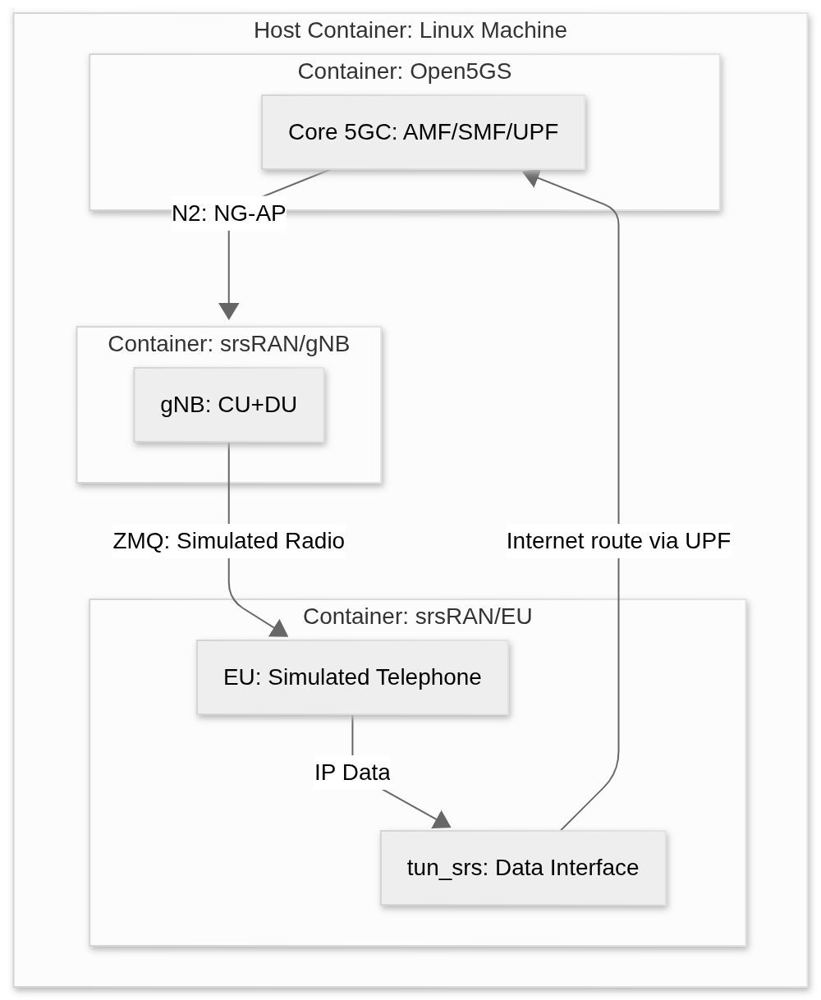

# Traditional 5G Network Lab

Welcome to this hands-on lab where we will build a complete 5G mobile network from scratch using open-source software. 

Every mobile network needs a central brain to manage users, security, and internet connectivity; this is called the **Core Network (or 5GC in 5G)**. In our lab, we'll be using **Open5GS**, an open-source project that implements a complete 5G Core. We chose it for its ease of use, stability, and because it's designed to run seamlessly in containers, simplifying deployment. The Core authorizes the user's device, known as the **User Equipment** (UE), which essentially authorizes your mobile phone to join the network.

To implement the radio access network (the UE + RU + gNB part), we'll use **srsRAN**. This is an amazing open-source software project that implements the entire 4G and 5G radio protocol stack. In our exercise, one srsRAN component will act as a **gNB** (the 5G base station), combining the functions of the **CU and DU** into a single component. Another srsRAN component will simulate the **UE** (the user terminal). To simulate the **RU** and the air link, srsRAN uses an ingenious *driver*, GNURadio + ZMQ, which replaces the radio frequency with a local network connection between our programs.

To build this complex environment on a single machine, we rely on **Docker**. This "container" technology allows us to package each component (the Core, the gNB, and the UE) into isolated software boxes. These boxes, or containers, are much lighter than virtual machines and ensure that one software's dependencies don't conflict with another's. All of this will run on our **host machine**, which is simply our physical computer (running a Linux operating system) that hosts the Docker software and all the containers that make up the network.

Once the network is up and running, we need to measure it. To do this, we'll use two essential tools. **Wireshark** is a "protocol analyzer" or *sniffer*, which allows us to capture and view every data packet flowing through the network; This is vital for debugging and understanding what the components are "talking" to each other. To generate traffic and measure performance, we'll use iperf3, a standard tool that acts as a speedometer to measure the maximum bandwidth our simulated network can handle.

The ultimate goal of these measurements is to evaluate performance and quality. We'll perform latency tests (also known as delay), which measures how long it takes for a packet to travel from the UE to the core and back; this is critical for interactive applications like online games. We'll also analyze QoS (Quality of Service), which is the network's ability to prioritize traffic. For example, a video call (sensitive to delay) should take priority over downloading a large file. Simulating and measuring this is fundamental to understanding how O-RAN architectures can deliver on the stringent performance promises of 5G.

## Prerequisites

Before starting the lab build, ensure you have the following environment prepared on your host machine:

* **Operating System:** A host machine running **Linux**. Ubuntu 20.04 LTS or 22.04 LTS is recommended for optimal compatibility.

* **Container Software:** **Docker** and **Docker Compose** must be installed and working. This is essential for managing the different network components in isolated environments. [Official installation guide.](https://docs.docker.com/engine/install)

* **Version Control:** **Git** is required to clone the Open5GS and srsRAN software repositories. [Official Installation Guide.](https://git-scm.com/install/linux)

* **Building Tools:** You will need basic building tools (such as `build-essential` and `cmake` on Ubuntu) to compile srsRAN from source and build the Docker images.

```sudo apt-get install cmake make gcc g++ build-essential pkg-config libfftw3-dev libmbedtls-dev libsctp-dev libyaml-cpp-dev libgtest-dev```

* **Basic Knowledge:** Familiarity with the **Linux terminal** (basic commands) and fundamental concepts of **IP networking** (addressing, subnets) is assumed.

## 5G Network Architecture

For this exercise, our focus is on simulation and performance evaluation in a controlled environment. Instead, we will emulate a complete 5G architecture where srsRAN and Open5GS interact within containers.

Our architecture will simulate the 5G Network architecture as follows:

* The **Core (5GC):** We will use **Open5GS** (in a container). This project implements all the components of the 5G Core (AMF, SMF, UPF, etc.) and will act as the centralized "brain" of our network.

* The **gNB (5G Base Station) of srsRAN** (in a container) will act as a monolithic unit that combines the functions of the **CU and DU**. It will connect to the Open5GS Core via the standard NG interface.

* The **RU (Radio Unit):** The physical radio interface (the "air") will be simulated. We will use the **ZMQ (ZeroMQ)** driver from srsRAN. This driver acts as a "virtual RU" that replaces radio frequency (RF) transmission with a local network channel (a TCP socket).

* **UE (User Equipment):** The **srsRAN UE** (in a container) will simulate the mobile device. Instead of using radio, it will connect directly to the gNB via the ZMQ channel, completing the simulated radio link.

The following diagram illustrates how these containers will interact:


-----

## Step 1: Deploying the Core Network (Open5GS) and RAN Network

In this first step, we will deploy the "brain" of our 5G network. We will use **Open5GS** as it is a complete open-source implementation of the 5G Core, designed to be easily deployed using Docker. Additionally, we will integrate the simulated radio access network (RU-DU-CU) using UERANSIM.

### 1\. Clone the Open5GS Repository

The easiest way to deploy Open5GS is by using a repository prepared for containerized deployment. This environment requires building the Docker images from the source code to ensure compatibility.

Open a terminal on your host machine and clone the repository:

```bash
git clone https://github.com/wocn-unicamp/5g-network-udelar.git
```

### 2\. Environment Configuration

Before building the images, it is essential to configure the environment variables. These control software versions and network settings.

Edit the `.env` file located in the project root. The key parameters are:

* `OPEN5GS_VERSION`: The Open5GS version to use (tag, branch, or commit ID). *Default: v2.7.6*
* `UBUNTU_VERSION`: The base Ubuntu Docker image version. *Default: jammy*
* `MONGODB_VERSION`: The MongoDB database version. *Default: 8.0*
* `NODE_VERSION`: The Node.js version for the WebUI. *Default: 20*
* `DOCKER_HOST_IP`: **(Critical)** The IP address of the host running Docker. This is required for the UPF to correctly advertise its route within the container network.

**To get your local IP:**
Run the following command in your terminal:

```bash
hostname -I | awk '{print $1}'
```

Copy the resulting IP address and paste it into the `DOCKER_HOST_IP` field in the `.env` file.

### 3\. Build the Base Image

Before starting the services, you must compile the base image shared by the Core microservices (AMF, SMF, UPF, etc.).

From the root directory of the cloned repository, run:

```bash
make base-open5gs
```

*Note: This command downloads dependencies and compiles the Open5GS source code on a clean Ubuntu image. This step may take several minutes.*

### 4\. Network Initialization (Core + RAN)

Once the base image is created, we proceed to launch the full infrastructure. We will use the `docker-compose.yml` file located in `compose-files/minimal-network/`, which deploys:

1. The 5G Core (Open5GS).
2. The Management Web Interface (WebUI).
3. The Monitoring Stack (Prometheus and Grafana).
4. The RAN and UE Simulator (UERANSIM).

Execute the following commands:

```bash
cd compose-files/minimal-network/
docker compose --env-file=../../.env up -d
```

**Important Notes:**

* The `-d` flag runs the containers in the background (detached mode).
* The first execution will download the remaining images, which may take some time.
* To stop and remove the deployment, use: `docker compose --env-file=../../.env down`.

Verify that all containers are operational with:

```bash
docker compose ps
```

*Expected Result:* You should see a list of services in the "Up" (or "running") state, including `amf`, `smf`, `upf`, `nrf`, `db`, `webui`, `prometheus`, and `grafana`.

### 5\. Register a Subscriber (UE)

Although the network is active, the 5G Core will reject connections from unknown devices. We must manually register the simulated User Equipment (UE) in the database.

1. **Access the Web Interface:**
    Open your browser and go to `http://localhost:9999`.

      * **User:** `admin`
      * **Password:** `1423`

2. **Navigate to Subscribers:**
    In the left-hand menu, click on **"Subscribers"**.

3. **Add a New Subscriber:**
    Click the green **"+" (Add)** button.

4. **Fill in the Subscriber Data:**
    Fill in the fields with the **exact** values configured in the simulator file `configs/minimal-network/ue1.yaml`. Any mismatch will cause an authentication failure.

    **Required Data:**

      * **IMSI:** `001011234567892`
      * **Security Header:** Leave as default.
      * **Subscriber Key (K):** `00000000000000000000000000000000`
      * **USIM Type:** `OPc` *(Note: Select OPc, not OP)*.
      * **Operator Key (OPc):** `00000000000000000000000000000000`
      * **AMF:** `8000`

    **"Slice" Section:**

      * Click **"Add Slice"**.
      * **SST:** `1`
      * **SD:** `000001` (or `1`)
      * **Default Selection:** Check/Enable.

    **"Session Management" (APN) Section:**

      * Click the **"+"** button inside the created Slice.
      * **DNN / APN:** `internet`
      * **Type:** `IPv4`
      * **PCC Rule:** Leave empty.
      * **QoS Profile:** Use default value (Index 9).

5. **Save:**
    Click **"Save"**.

### 6\. Validation and Connectivity Tests

To apply changes and test the connection, restart the simulated user container:

```bash
docker restart ue1
```

**A. Check Connection Logs:**
Watch the connection process in real-time:

```bash
docker logs -f ue1
```

*Successful Output:*

```plaintext
[nas] [info] Initial Registration is successful
[nas] [info] PDU Session establishment is successful PSI[1]
[app] [info] Connection setup for PDU session[1] is successful, TUN interface[uesimtun0, 10.45.0.3] is up.
```

**B. Ping Test (Data Traffic):**
Verify that the UE has internet access through the 5G Core:

```bash
docker exec -it ue1 ping -I uesimtun0 8.8.8.8
```

*Expected Result:*

```plaintext
64 bytes from 8.8.8.8: icmp_seq=1 ttl=117 time=11.6 ms
```

**C. Grafana Validation (Monitoring):**

1. Open Grafana at `http://localhost:3000`.
2. **Credentials:** `admin` / `grafana`.
3. Go to **Dashboards \> Open5GS \> AMF**.
4. You should observe:
      * **Number of UEs Registered:** 1
      * **PDU Sessions:** 1

-----

## Step 2: Performance Evaluation and Traffic Generation

Once the UE is successfully connected (`Attached`), the final objective is to validate the 5G network's capability to transport user data. We will use **iperf3**, the industry standard tool for active measurement of bandwidth, latency, and Quality of Service (QoS).

### 1\. Diagnostic Tools Preparation

By default, Docker containers are lightweight and do not include advanced networking tools. We will proceed to install them at runtime without stopping the services.

**A. Install iperf3 on Client (UE) and Server (UPF):**
Execute the following command in your host machine terminal:

```bash
docker exec -u 0 -it ue1 apt-get update && docker exec -u 0 -it ue1 apt-get install -y iperf3 iproute2
docker exec -u 0 -it upf apt-get update && docker exec -u 0 -it upf apt-get install -y iperf3
```

**B. Start the Traffic Server (UPF):**
The UPF will act as the termination point ("Internet"). Run the server in the background:

```bash
docker exec -d upf iperf3 -s
```

### 2\. Tunnel IP Identification (Critical Verification)

**Warning:** To measure the actual 5G network speed, traffic must be forced through the tunnel interface (`uesimtun0`). Docker assigns this IP dynamically. If an incorrect IP or the default Docker interface is used, `iperf3` will fail with a `Bad file descriptor` error or measure the local bus speed instead of the 5G network.

**Instruction:**
Retrieve the IP assigned to the user's 5G interface:

```bash
docker exec ue1 ip -4 addr show uesimtun0
```

*Example Output:*
`inet 10.45.0.2/16 ...` -\> In this case, your IP is **10.45.0.2**.
`inet 10.45.0.3/16 ...` -\> In this case, your IP is **10.45.0.3**.

> **Note:** In the commands for the following steps, replace `<UE_IP>` with the specific IP address you just obtained.

### 3\. Latency Test (Ping)

Evaluation of the Round Trip Time (RTT) over the user plane.

**Command:**

```bash
docker exec -it ue1 ping -I uesimtun0 -c 20 10.45.0.1
```

**Expected Result:**

```text
64 bytes from 10.45.0.1: icmp_seq=1 ttl=64 time=2.51 ms
...
rtt min/avg/max/mdev = 1.270/2.531/3.013/0.376 ms
```

### 4\. TCP Throughput Test (Bandwidth)

Measurement of the maximum transfer capacity for Uplink and Downlink.

**A. Uplink Test (UE $\rightarrow$ Network):**

```bash
# Remember to replace <UE_IP> with your IP (e.g., 10.45.0.2)
docker exec -it ue1 iperf3 -c 10.45.0.1 -B <UE_IP> -t 20
```

**B. Downlink Test (Network $\rightarrow$ UE):**

```bash
docker exec -it ue1 iperf3 -c 10.45.0.1 -B <UE_IP> -t 20 -R
```

**Expected Result:**
Observe the **Bitrate** column. You should see stable values close to **1.00 Gbits/sec** (the exact value will depend on the host CPU).

### 5\. QoS and Jitter Test (UDP)

Simulation of a real-time application (such as VoIP or video calling) by forcing a constant 50 Mbps stream to analyze packet loss and delay variation.

**Command:**

```bash
docker exec -it ue1 iperf3 -c 10.45.0.1 -B <UE_IP> -u -b 50M -t 20
```

**Expected Result:**

```text
[ ID] Interval           Transfer     Bitrate        Jitter    Lost/Total Datagrams
[  5]   0.00-20.04 sec   119 MBytes   49.9 Mbits/sec 0.029 ms  0/92726 (0%)
```

### 6\. Results Analysis (Interpretation)

The student must include the following technical analysis in their final report:

**A. Latencia and URLLC**

* **Observation:** Average latency is around **2.5 ms**.
* **Analysis:** This value meets theoretical low-latency requirements for 5G (URLLC). Although the air interface is simulated in this lab (eliminating physical propagation delays), the result validates the efficiency of the GTP-U protocol encapsulation and decapsulation within the Open5GS Core.

**B. Stability (Jitter)**

* **Observation:** The *Jitter* (delay variation) in the UDP test is close to **0.03 ms**.
* **Analysis:** Near-zero jitter indicates a highly deterministic network. For voice services (VoIP), Jitter \< 30 ms is required. The simulated network far exceeds this requirement, demonstrating a lack of congestion in the UPF buffers.

**C. Throughput and Capacity**

* **Observation:** Symmetric speeds of **\~1 Gbps** were achieved.
* **Analysis:**
  * Symmetry in upload/download is characteristic of an idealized configuration in simulation.
  * **Retransmissions:** A high number of TCP retransmissions (`Retr`) may be observed. In simulated environments, this does not indicate poor signal, but rather saturation of the host CPU while processing packets at Gigabit speeds, causing drops in the virtual network stack.

**D. Reliability (Packet Loss)**

* **Observation:** Packet loss in UDP was **0%**.
* **Analysis:** The successful transmission of over 90,000 datagrams validates the integrity of the PDU session and correct routing between the gNB and the UPF.

**End of Lab.**
With these results, the 5G Stand Alone network (Core + RAN) is certified as fully operational.


<!-- ```bash
cd compose-files/minimal-network/

docker compose -f compose-files/metrics/docker-compose.yaml --env-file=.env up -d

docker compose --env-file=../../.env up -d
docker compose --env-file=../../.env up -d --force-recreate
docker compose --env-file=../../.env down

```

```
docker stop $(docker ps -aq)
docker system prune -a --volumes
docker builder prune
docker network prune -f
``` -->
